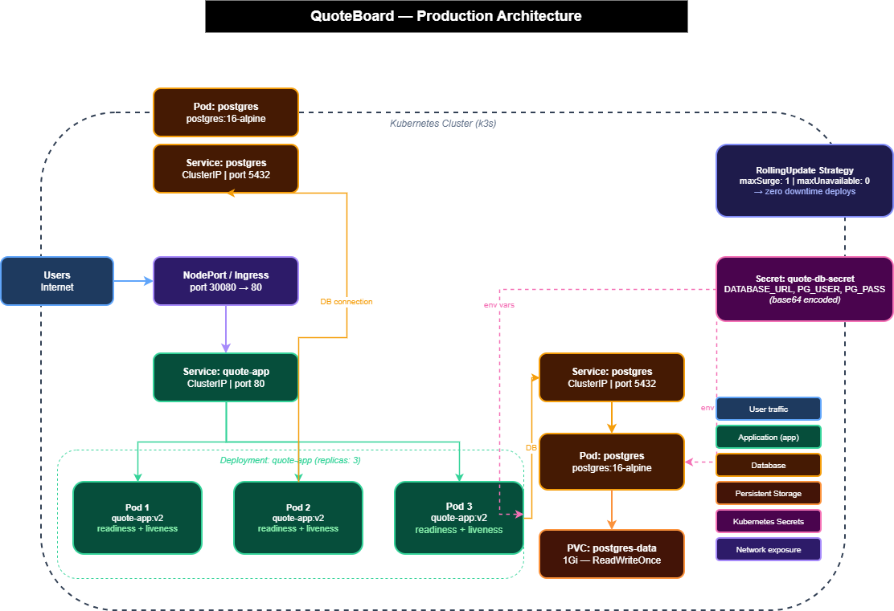

# Current System Problems

## Problème 1 — PostgreSQL dans le même container que l'application
L'application et la base de données tournent dans le même pod.
Si le pod redémarre ou crashe, les deux composants tombent simultanément.

## Problème 2 — Pod unique, aucune résilience
Un seul pod fait tourner l'ensemble du système. Aucune redondance n'est
en place. Le moindre redémarrage ou crash entraîne une interruption de
service visible pour les utilisateurs.

## Problème 3 — Pas de readiness ni liveness probes
Kubernetes ne sait pas si l'application est réellement prête à recevoir
du trafic. Un pod démarré mais non fonctionnel continuera à recevoir des
requêtes, causant des erreurs côté utilisateur.

## Problème 4 — Pas de resource limits
Sans limites CPU/mémoire, un pod peut consommer toutes les ressources
du nœud et provoquer l'effondrement des autres workloads (resource starvation).

## Problème 5 — Secrets en clair dans les variables d'environnement
Les credentials de la base de données sont exposés directement dans
les manifests YAML. Ils sont visibles via kubectl describe, dans les
logs et dans le dépôt Git si mal configuré.

## Problème 6 — Pas de stratégie de rollout
Les déploiements remplacent immédiatement les pods sans transition.
Chaque mise à jour provoque une interruption de service, même brève.

# Production Architecture

## Vue d'ensemble

L'architecture redessinée sépare clairement l'application et la base de
données, introduit de la redondance, et sécurise les secrets.

## Composants

### Application Deployment (quote-app)
- 3 réplicas pour la haute disponibilité
- Stratégie RollingUpdate (maxSurge: 1, maxUnavailable: 0)
- Readiness et liveness probes sur /health
- Resource requests et limits définis
- Secrets injectés via Kubernetes Secrets (pas en clair)

### Service (ClusterIP + NodePort)
- ClusterIP pour la communication interne
- NodePort ou Ingress pour l'accès externe
- Load balancing automatique entre les 3 réplicas

### PostgreSQL Deployment (séparé)
- Pod dédié, isolé de l'application
- PersistentVolumeClaim pour la persistance des données
- Accessible uniquement via un Service ClusterIP interne
- Credentials injectés via Kubernetes Secrets

### Kubernetes Secrets
- Les credentials de la base de données sont stockés dans un Secret
- Jamais écrits en clair dans les manifests committés

## Diagramme

# Operational Strategy

## Comment le système scale ?
L'application tourne avec 3 réplicas minimum. En cas de charge accrue,
on peut augmenter le nombre de réplicas via kubectl scale ou en modifiant
le champ replicas dans le Deployment. Le Service ClusterIP répartit
automatiquement le trafic entre tous les pods disponibles.
La base de données PostgreSQL reste sur un pod unique avec un PVC dédié,
elle ne scale pas horizontalement.

## Comment les mises à jour sont déployées en sécurité ?
La stratégie RollingUpdate est configurée avec :
- maxSurge: 1 — un pod supplémentaire est créé avant de supprimer l'ancien
- maxUnavailable: 0 — aucun pod ne peut être indisponible pendant le rollout

Cela garantit zéro downtime à chaque déploiement. En cas d'échec,
kubectl rollout undo permet de revenir immédiatement à la version précédente.

## Comment les pannes sont détectées ?
Deux mécanismes sont en place sur chaque pod applicatif :
- Liveness probe sur /health : si elle échoue, Kubernetes redémarre
  le container automatiquement
- Readiness probe sur /health : si elle échoue, le pod est retiré
  du Service et ne reçoit plus de trafic jusqu'à sa récupération

## Quels controllers Kubernetes gèrent la récupération ?
- Le ReplicaSet s'assure en permanence que 3 pods tournent. Si un pod
  disparaît, il en recrée un immédiatement.
- Le Deployment gère les mises à jour et conserve l'historique des
  révisions pour permettre les rollbacks.
- Le kubelet surveille les probes sur chaque nœud et redémarre
  les containers défaillants localement.

# Weakest Point

## Quel est le point le plus faible de cette architecture ?

Le point le plus faible est **la base de données PostgreSQL**.

Elle tourne sur un pod unique sans réplicas. Si ce pod tombe ou si le
nœud qui l'héberge devient indisponible, toute l'application perd l'accès
aux données immédiatement — même si les 3 pods applicatifs continuent
de tourner.

Le PVC est attaché au nœud local. Si ce nœud est perdu physiquement,
les données peuvent être perdues définitivement. Il n'y a pas de backup
automatique ni de réplication des données vers un autre nœud.

## Pourquoi ce composant céderait-il en premier sous stress ?

Sous forte charge, PostgreSQL sera le premier goulot d'étranglement :
- Les 3 réplicas applicatifs envoient tous leurs requêtes vers un seul pod
- Le pod postgres a ses propres resource limits qui peuvent être atteintes
- Une saturation mémoire provoque un OOMKill du pod, coupant toutes
  les connexions actives simultanément

## Comment l'améliorer ?

En production réelle, on utiliserait :
- Une solution managée comme AWS RDS ou Google Cloud SQL
- Ou un opérateur Kubernetes dédié comme CloudNativePG pour gérer
  la réplication et le failover automatique de PostgreSQL

  # Stretch Thinking

## Qu'est-ce qui céderait en premier sous 10× le trafic ?

PostgreSQL serait le premier goulot d'étranglement. Les 3 pods applicatifs
multiplieraient leurs requêtes vers un seul pod Postgres qui n'a pas été
dimensionné pour absorber une telle charge. Ses resource limits seraient
atteintes rapidement, provoquant du throttling CPU puis un OOMKill.
L'application continuerait de tourner mais toutes les requêtes vers la
base de données échoueraient.

## Quels signaux de monitoring surveiller en priorité ?

- Latence des requêtes HTTP (p95, p99) — premier signe de dégradation
- Consommation mémoire du pod postgres — indique un risque d'OOMKill
- Nombre de connexions actives sur PostgreSQL — détecte la saturation
- Taux d'erreurs 5xx sur le Service — visible côté utilisateur
- CPU throttling sur les pods applicatifs — indique des limits trop basses

## Comment déployer ce système sur plusieurs nœuds ou régions ?

Sur plusieurs nœuds : utiliser un cluster Kubernetes multi-nœuds avec
un StorageClass distribué (ex: Longhorn, Ceph) pour que le PVC ne soit
plus attaché à un seul nœud. Le scheduler Kubernetes répartirait
automatiquement les pods sur les nœuds disponibles.

Sur plusieurs régions : déployer un cluster par région avec un load
balancer global devant (ex: AWS Route53, Cloudflare). La base de données
serait répliquée entre régions via une solution managée comme AWS RDS
Multi-AZ. C'est plus complexe car il faut gérer la cohérence des données
entre régions.

## Quelle partie nécessiterait des machines virtuelles plutôt que des containers ?

PostgreSQL en production critique bénéficierait d'une VM dédiée ou d'un
service managé. Une base de données a besoin d'un accès direct au stockage
physique, de garanties IOPS précises et d'une isolation forte pour éviter
qu'un autre workload ne perturbe ses performances. Les containers partagent
le kernel et le scheduler CPU de l'hôte, ce qui peut introduire de la
latence imprévisible pour une base de données.