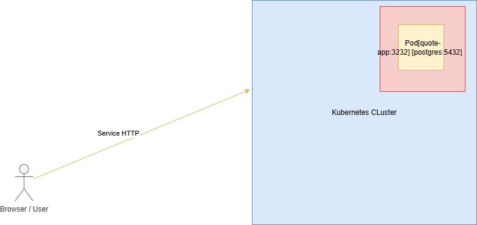

# Etape 2 : 
# Notes d'Architecture — Lab 85

## Diagramme de l'architecture actuelle

## Analyse de l'architecture

### Où se passe l'isolation ?
L'isolation se produit au niveau des containers à l'intérieur du Pod.
Chaque container (quote-app et postgres) tourne dans son propre espace
de processus isolé, avec son propre système de fichiers et son interface
réseau. Le Pod est lui-même isolé des autres Pods via le réseau Kubernetes.

### Qu'est-ce qui redémarre automatiquement ?
Kubernetes redémarre automatiquement les containers qui plantent via le
kubelet. Le contrôleur ReplicaSet s'assure que le nombre de Pods souhaité
tourne en permanence. Si un Pod meurt, le ReplicaSet en recrée un nouveau.

### Qu'est-ce que Kubernetes ne gère PAS ?
- La machine physique ou virtuelle qui héberge le nœud
- L'infrastructure réseau externe au cluster
- Les données réelles dans le PersistentVolume (pas de backup automatique)
- La configuration DNS en dehors du cluster
- Le système d'exploitation du nœud

# Etape 3 : 

## Comparaison Containers vs Machines Virtuelles

| Critère               | Container                              | Machine Virtuelle (VM)                  |
|-----------------------|----------------------------------------|-----------------------------------------|
| Partage du kernel     | Partage le kernel de l'hôte            | Kernel propre à chaque VM               |
| Temps de démarrage    | Très rapide (secondes)                 | Lent (minutes)                          |
| Overhead ressources   | Léger (pas d'OS complet)               | Lourd (OS complet par VM)               |
| Isolation sécurité    | Isolation partielle (kernel partagé)   | Isolation forte (hyperviseur)           |
| Complexité opération  | Simple à orchestrer (Kubernetes)       | Plus complexe à gérer                   |

## Quand préférer une VM à un container ?
- Quand on a besoin d'une isolation forte (ex: clients différents sur le même serveur)
- Quand l'application nécessite un OS différent (ex: Windows sur hôte Linux)
- Pour des workloads legacy qui ne sont pas containerisables
- Dans des contextes de sécurité stricts (banques, défense)

## Quand combiner les deux ?
- Les nœuds Kubernetes tournent souvent sur des VMs dans le cloud
- On utilise des VMs pour isoler les clusters entre eux
- Les containers tournent à l'intérieur des VMs pour la flexibilité
- Ex: AWS EC2 (VM) qui héberge des pods Kubernetes (containers)

# Etape 4 : 

## Scaling horizontal

### Commande utilisée
`kubectl scale deployment quote-app --replicas=3 -n quote-lab`

### Qu'est-ce qui change quand on scale ?
- Le nombre de Pods passe de 1 à 3
- Le trafic est réparti entre les 3 pods via le Service (load balancing)
- La capacité de traitement des requêtes augmente
- La résilience augmente : si un pod tombe, les 2 autres continuent

### Qu'est-ce qui ne change pas ?
- Le Service reste le même (même IP, même port)
- La base de données reste unique (partagée par les 3 pods)
- La configuration de l'application ne change pas
- L'URL d'accès reste identique pour l'utilisateur

# Etape 5 : 

## Simulation de panne

### Qui a recréé le pod ?
Le contrôleur **ReplicaSet** de Kubernetes a recréé le pod automatiquement.
Il surveille en permanence que le nombre de pods correspond au nombre
souhaité (replicas: 3). Dès qu'un pod disparaît, il en recrée un nouveau.

### Pourquoi ?
Car le Deployment définit un état désiré (3 replicas). Le ReplicaSet
est responsable de maintenir cet état en permanence. C'est le principe
de la "réconciliation" dans Kubernetes.

### Que se passerait-il si le nœud lui-même tombait ?
Si le nœud (la machine) tombe, Kubernetes détecterait le nœud comme
"NotReady" après un délai (~5 minutes). Les pods seraient alors
replanifiés sur un autre nœud disponible. Dans notre cas avec un seul
nœud, l'application serait indisponible jusqu'au retour du nœud.
C'est pourquoi une architecture de production nécessite plusieurs nœuds.

# Etape 6 : 

## Resource Limits

### Requests vs Limits

**Requests** : c'est la quantité de ressources **garantie** au container.
Kubernetes utilise cette valeur pour décider sur quel nœud placer le pod.
Si un nœud n'a pas assez de ressources disponibles, le pod ne sera pas
planifié dessus.

**Limits** : c'est le **maximum** que le container peut consommer.
Si le container dépasse la limite CPU, il est ralenti (throttling).
S'il dépasse la limite mémoire, il est tué (OOMKilled) et redémarré.

### Pourquoi c'est important dans un système multi-tenant ?
Dans un cluster partagé entre plusieurs équipes ou applications :
- Sans limits, un container peut consommer toutes les ressources du nœud
  et faire tomber les autres applications
- Les requests garantissent que chaque app a les ressources minimales
  dont elle a besoin
- Les limits protègent le cluster contre les fuites mémoire ou les
  boucles infinies qui consommeraient tout le CPU